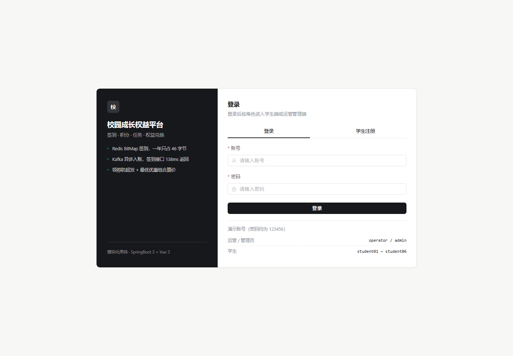
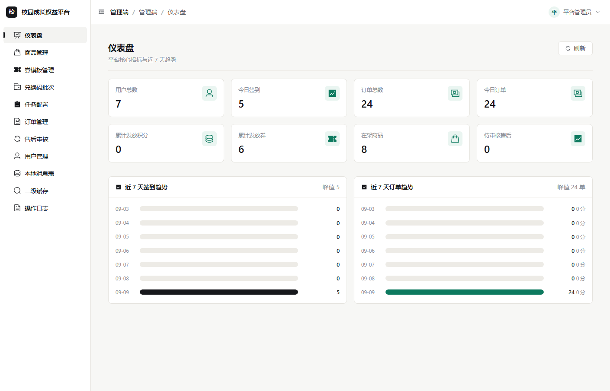
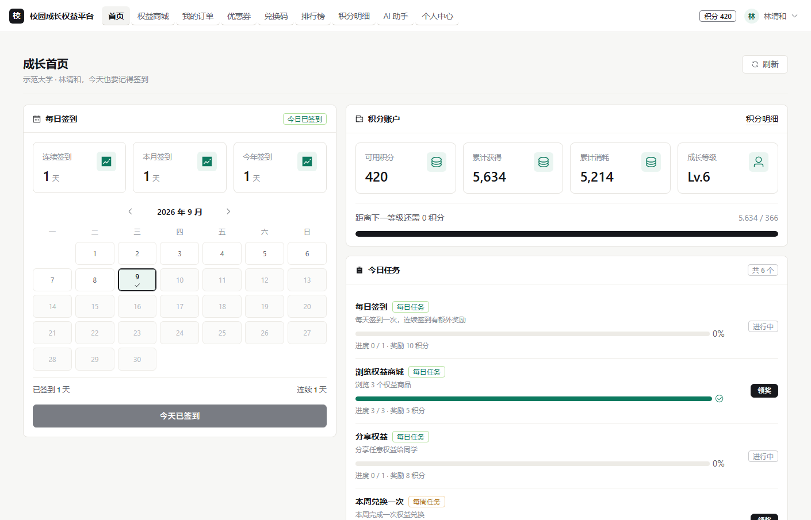
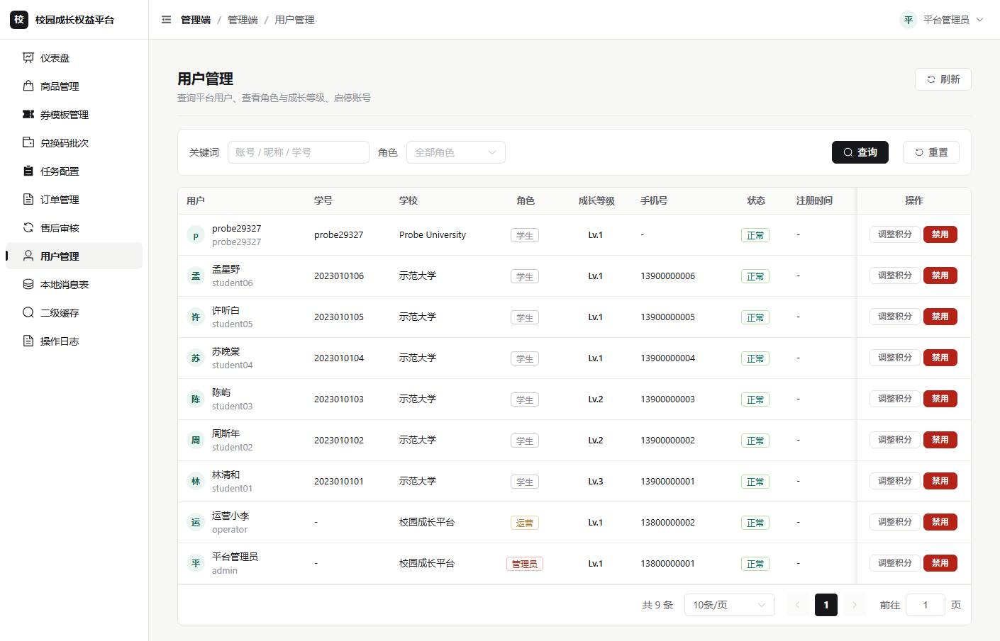

# 校园成长权益平台 · Campus Growth

[](https://github.com/trc667/benefit_platform/actions/workflows/ci.yml)
[](LICENSE)
[](backend/pom.xml)
[](frontend/package.json)

> 面向高校学生的**成长积分 / 任务激励 / 权益兑换**平台，前后端分离。
> 后端是 **SpringBoot3 模块化单体**（不是微服务），前端是 **Vue3 + Element Plus** 的学生端 + 运营管理端。
>
> 定位：个人开源项目 / 简历展示。重点不在堆组件，而在**高并发下的正确性**：缓存怎么分层、锁怎么不出错、异步怎么不丢消息。

---

## 0. 界面预览

| 登录（Ink & Jade 主题） | 运营仪表盘 |
| --- | --- |
|  |  |

| 学生端首页 | 管理端用户列表 |
| --- | --- |
|  |  |

<sub>截图由无头浏览器对真实运行的应用渲染，非设计稿；配色规范见 §3.1。</sub>

---

## 1. 它解决什么问题

学生在校园里缺少"正向行为 → 即时反馈"的闭环：签到、参加活动、完成学习任务，很难沉淀成可感知的成长记录。
这个平台把三件事串起来：

1. **签到 / 任务** 产生成长积分（Redis BitMap + 异步入账，扛得住瞬时高峰）；
2. **积分排行榜** 提供社交激励（Redis ZSet，实时 Top N）；
3. **权益商城** 让积分能换真东西（研修间、咖啡券、打印额度……），配套**优惠券、兑换码、订单与售后**完整交易链路；
4. **AI 助手** 用自然语言完成"查权益 → 算优惠 → 下单"（Function Calling 调真实业务接口）。

---

## 2. 技术栈

| 层 | 选型 |
| --- | --- |
| 后端 | SpringBoot 3.2、MyBatis-Plus 3.5.7、MySQL 8/5.7、Redis、Kafka 3.7（KRaft） |
| 并发与可靠性 | Redisson（分布式锁）、Caffeine（本地缓存）、Guava RateLimiter、ThreadPoolExecutor + CompletableFuture、AspectJ |
| 服务演进预留 | Dubbo 3.3（**直连模式，仅订单/优惠券预留 RPC 接口，单体阶段零远程调用**） |
| 前端 | Vue 3、Vite 5、Pinia、Vue Router、Element Plus、axios |
| AI | OpenAI 兼容协议 HTTP 直连（Function Calling + 轻量模型分流），未配置 Key 时降级为本地规则引擎 |

**刻意不引入**：Nacos / Sentinel / SpringCloud Alibaba / OpenFeign / Seata / 网关 / 注册中心。
理由见 [`docs/01-architecture.md`](docs/01-architecture.md) 第 1 节——单人项目引这些只会放大运维成本。

---

## 3. 十项核心技术点（都指向可运行的代码）

| # | 能力 | 代码位置 | 怎么验证 |
| --- | --- | --- | --- |
| 1 | 签到用 Redis BitMap（月/年双位图），成功后发 Kafka 事件异步加积分 | `modules/signin/service/impl/SignInServiceImpl`、`modules/point/mq/SignInEventConsumer` | `redis-cli bitcount`；集成测试 `SigninKafkaFlowTest` |
| 2 | 任务进度双层存储：Redis 热数据（秒级可见）+ Kafka 异步落库 | `modules/task/service/impl/TaskServiceImpl`、`modules/task/mq/TaskProgressConsumer` | 页面刷新不丢进度；`user_task_progress` 单调递增 |
| 3 | Redisson 分布式锁统一封装（看门狗、超时、防误删） | `infra/lock/DistributedLockTemplate` | 并发压测只落一条 |
| 4 | 自研 Base32 + 分段编码兑换码（20 亿级容量），BitMap 核销防重复 | `common/util/Base32Codec`、`RedeemCodeUtil`、`modules/redeem` | 单测 22 项全绿；重复兑换返回 7002 |
| 5 | 领券防超发 + **复现"锁在事务内导致锁失效"并用切面顺序修复** | `modules/coupon/service/impl/CouponServiceImpl`、`common/aspect/AspectOrder`、`modules/coupon/service/LockOrderDemoService` | `POST /api/admin/coupon/demo/lock-order` 直接看对比结果 |
| 6 | 结算页枚举优惠组合 + `CompletableFuture` 并行算价 + 策略选最优 | `modules/order/service/OptimalDiscountCalculator` | 结算预览返回 `bestPlan` 与全部候选 |
| 7 | AI 助手 Function Calling（查权益/下单/取消/进度）+ 轻量模型 HTTP 直连生成文案 | `modules/ai` | 对话返回真实 `toolCalls`；`/api/ai/order-summary` |
| 8 | Caffeine + Redis 二级缓存，Cache-Aside，防击穿/穿透/雪崩 | `infra/cache/TwoLevelCache` | `/api/admin/cache/stats` 看命中率与回源次数 |
| 9 | 双层限流：Guava 单机令牌桶 → Redis 分布式窗口计数（一键切换） | `infra/ratelimit`、`common/aspect/RateLimitAspect` | 压签到/领券接口返回 429 |
| 10 | 订单/优惠券同时提供本地 Service 与 Dubbo RPC 接口，为渐进式拆分留缝 | `modules/order/rpc`、`modules/coupon/rpc` | `dubbo.enabled=false` 时零远程调用 |

补充可靠性设计：**本地消息表**（`mq_event_outbox`）+ **消费幂等**（`mq_consume_record` 唯一索引）+ **指数退避补偿**，
保证"业务成功 → 事件最终必达"，Kafka 挂掉也不丢事件。

---

## 3.1 前端视觉规范：Ink & Jade（墨青）

后台系统最容易出现的"AI 味"是三件事：紫蓝渐变、到处发光的悬浮卡片、Element Plus 默认的冷蓝灰（`#409eff` / `#f5f7fa`）。
这套主题反过来做——**层次靠发丝分隔线和留白，不靠阴影和渐变**：

| 维度 | 取值 | 说明 |
| --- | --- | --- |
| 页面底色 | `#f7f7f5` 暖白纸感 | 不是冷灰，长时间看不发青 |
| 主色 | `#17181c` 近黑墨色 | 主按钮、标题、导航激活态（Linear / Vercel 那一类克制感） |
| 强调色 | `#0d7a5f` 青玉 | 只承载"成长 / 积分 / 已完成"的语义，全局唯一一处彩色 |
| 语义色 | `#b42318` / `#96600a` | 低饱和红与琥珀，不用荧光色 |
| 边框 | `1px #e5e3de` 暖灰发丝线 | 卡片静止态**没有阴影**，只有边框 |
| 圆角 | 6px（控件）/ 8px（卡片） | 不用大圆角胶囊 |
| 字体 | 系统字体栈，13px 表格 / 14px 正文 / 20px 页标题 | 不引 Inter，不引网络字体 |
| 数字 | `font-variant-numeric: tabular-nums` | 表格与金额上下对齐 |
| 动效 | 120–160ms `cubic-bezier(.2,0,.2,1)` | 不做悬浮上浮、不做发光 |
| 焦点 | `2px` 青玉描边 + 2px offset | WCAG 2.1 AA 焦点可见 |

实现落点：`frontend/src/styles/index.css`（tokens + Element Plus 变量映射）、`frontend/src/styles/layout.css`（框架与组件局部样式）。
变量名沿用 `--cg-primary` / `--cg-text-1` 等旧名，38 个页面无需改动即整体生效；登录页改成了**左侧墨色品牌区 + 右侧表单**的分栏，不再是居中一张卡。

> 校验方式：`node scripts/verify.mjs` 静态校验 + 生产构建 + 无头浏览器读取真实计算样式（body 底色、卡片边框/阴影、表格字号、导航激活条、全页 gradient 数量为 0）。

---

## 4. 快速开始

### 4.1 环境要求

| 组件 | 版本 | 说明 |
| --- | --- | --- |
| JDK | **17+** | SpringBoot 3 要求；脚本会自动探测（参数 → `JAVA_HOME` → 常见安装目录） |
| Maven | 3.9+ | 也可以直接用仓库自带的 `backend\mvnw.cmd`，无需单独安装 |
| MySQL | 5.7 / 8.0 | 表设计规避了 8.0 专有语法，5.7 也能跑 |
| Redis | 3.2+ | 用了 BitMap / ZSET / Lua，3.2 就够 |
| Kafka | 3.7（KRaft） | **可选**：不启动也能跑，事件先落本地消息表，恢复后自动补发 |
| Node.js | 18.18+ | 前端构建（Vite 5 要求） |

> **脚本是 Windows PowerShell**。macOS / Linux 用户请自行启动 MySQL、Redis、Kafka，然后
> `cd backend && ./mvnw spring-boot:run -Dspring-boot.run.profiles=dev`、`cd frontend && npm i && npm run dev`。

### 4.2 启动步骤

```powershell
# 0) 配置数据库密码（二选一，不要写进 application.yml）
#    a. 复制一份本地配置：backend\src\main\resources\application-local.yml（已被 .gitignore 忽略）
#       spring.datasource.password: 你的密码
#    b. 或设置环境变量：$env:MYSQL_PASSWORD="你的密码"

# 1) 初始化数据库（会重建 campus_growth 库）
.\scripts\init-db.ps1 -Password 你的MySQL密码

# 2) 启动 Redis（复用机器上已有的 Redis for Windows）
.\scripts\start-redis.ps1

# 3) 启动 Kafka（可选，但推荐；解压到 .tools\ 后执行）
.\scripts\start-kafka.ps1

# 4) 启动后端（默认 8090，dev profile）
.\scripts\start-backend.ps1

# 5) 启动前端（默认 5173，/api 已代理到 8090）
.\scripts\start-frontend.ps1

# 6) 一键验证核心链路（22 项，全部打印真实结果）
.\scripts\verify-e2e.ps1
```

浏览器打开 <http://127.0.0.1:5173>。

> ⚠️ 演示账号（`admin` / `operator` / `student01~06`，密码统一 `123456`）来自 `sql/data.sql`，
> **只用于本地体验**。真要部署，请先改掉这些账号的密码，并设置 `CAMPUS_JWT_SECRET`。

| 账号 | 密码 | 角色 |
| --- | --- | --- |
| `student01` ~ `student06` | `123456` | 学生 |
| `operator` | `123456` | 运营 |
| `admin` | `123456` | 管理员 |

> **Kafka 没启动会怎样？** 应用照常运行，签到等事件先落 `mq_event_outbox`；
> 启动 Kafka 后 30 秒内补偿任务自动补发，积分到账。这是本地消息表设计的直接体现。

---

## 5. 目录结构

```
vip_plateform/
├── backend/                      # SpringBoot3 模块化单体
│   └── src/main/java/com/campus/growth/
│       ├── common/               # 统一返回、异常、常量、注解、切面、上下文、工具
│       ├── config/               # Redis/Redisson/Kafka/线程池/Web/事务顺序/Dubbo 开关/AI
│       ├── infra/                # 与业务无关的中间件适配（锁、限流、二级缓存、事件发送）
│       └── modules/              # 按业务域分包，域内再分层
│           ├── auth signin point task benefit
│           ├── coupon            # 含 rpc/ 预留 Dubbo 接口
│           ├── redeem order      # 含 rpc/ 预留 Dubbo 接口
│           ├── ai mq system
├── frontend/                     # Vue3 + Element Plus（学生端 + 管理端）
│   └── src/{api,components,stores,router,utils,views,styles}
├── sql/                          # schema.sql（19 张表）+ data.sql（演示数据）
├── docs/                         # 架构 / 数据库 / 接口契约 / 运行手册
├── scripts/                      # 一键启动与端到端验证脚本
└── .mvn/settings.xml             # Maven 配置（https 阿里云镜像 + 项目内本地仓库）
```

---

## 6. 文档索引

| 文档 | 内容 |
| --- | --- |
| [`docs/01-architecture.md`](docs/01-architecture.md) | 架构决策、模块划分、关键链路时序、十条亮点落点、取舍说明 |
| [`docs/02-database.md`](docs/02-database.md) | 19 张表职责与索引、Redis 键设计、容量估算 |
| [`docs/03-api.md`](docs/03-api.md) | 前后端唯一接口契约 |
| [`docs/04-runbook.md`](docs/04-runbook.md) | 本地运行、配置项、验证清单、常见问题 |
| [`docs/loadtest-report.md`](docs/loadtest-report.md) | 压测报告（自动生成，含各场景数字与并发正确性断言） |
| [`loadtest/README.md`](loadtest/README.md) | 压测工具说明：场景设计、断言含义、结果怎么读 |

---

## 7. 压测与并发正确性（真实数字）

压测器是仓库自带的 **零依赖 Node 工具**（`loadtest/`，只用内置 `http` + keep-alive 连接池），
一条命令跑完全部场景并自动生成报告：

```powershell
# 压测前关掉限流，否则压到的是限流器而不是数据库/Redis
$env:CAMPUS_LIMIT_ENABLED='false'; .\scripts\start-backend.ps1

node loadtest/run.mjs --all --users 200 --stock 100
# → 控制台表格 + loadtest/results/*.json + docs/loadtest-report.md
```

| 场景 | 并发 | 吞吐 | P99 | 非预期错误率 | 关键结论 |
| --- | --- | --- | --- | --- | --- |
| 签到高峰（每用户并发 2 次） | 200 用户 × 2 | 982 req/s | 387 ms | **0%** | 200 人全部签到成功；重复请求被分布式锁/「今日已签到」明确拒绝（429/2001）；**积分只入账一次**；异步入账延迟 **P50 169ms / P95 289ms** |
| 领券秒杀 | 200 抢 100 张 | 546 req/s | 358 ms | **0%** | **恰好发出 100 张，零超发**，`issued_count` 与成功数一致 |
| 结算页最优优惠组合 | 100 持续 15s | 1744 req/s | 80 ms | **0%** | CompletableFuture 并行算价 2.6 万次请求零错误 |
| 积分账户热点写（同一账户） | 60 | 108 req/s | 556 ms | **0%** | 60/60 成功，余额增量 == 成功数 × 奖励（**修复前成功率只有 5%**） |
| 并发下单支付 | 200 | 186 req/s | 1073 ms | **0%** | 200 单全成功；扣减 30000 == 200×150；库存 -200；**没有任何账户被扣成负数** |
| 阶梯压测（50→800 并发） | 50→800 | 1780 req/s 见顶 | 42→504 ms | **0%** | 吞吐在 ~1780 req/s 饱和、P99 随并发线性上涨 → 典型吞吐饱和形态 |

> 「非预期错误率」只统计网络/HTTP 失败与业务码 500。**429（限流/锁）、6002（售罄）、2001（今日已签到）都是预期内的明确拒绝**，不算错误。

### 7.1 压测直接抓出的两个真实缺陷

这两条**只有并发才暴露**，看代码看不出来——这正是"压测不只测快慢，更要证对错"的价值：

| 级别 | 问题 | 定位与修复 | 修复效果 |
| --- | --- | --- | --- |
| **P0** | **积分账户热点行**：同一账户 60 并发写，只有 3 次成功（5%），其余全返回「积分更新冲突过于频繁」 | 原实现是「查账户 → 算新余额 → 带 version 乐观锁更新 → 冲突重试 3 次」，热点行上必然连环冲突 → 改为**数据库原子增减** `UPDATE ... SET balance = balance + ?`（余额不足判定下推到 SQL：`balance + ? >= 0`），再用同一事务内的当前读回填准确的 `balance_after` | 成功率 **5% → 100%**（60/60），流水与余额依然完全一致 |
| **P0** | **幂等键缺用户维度**：`@Idempotent` 的 key 只写了 `goodsId + quantity`，60 个不同用户同时下单同一商品，**59 个被"请勿重复提交"挡掉** | 在 `IdempotentAspect` 统一加 `u:{userId}:` 前缀——幂等的语义是"同一个人别连点"，不是"全站只准提交一次" | 下单成功率 **1/60 → 60/60** |

---

## 8. 已验证内容（真实执行结果）

| 验证项 | 命令 | 结果 |
| --- | --- | --- |
| 后端单元测试 | `mvn test` | **30 个测试全绿**（Base32 编解码 5、兑换码算法 7、注册准入策略 6、锁顺序实验 3、最优优惠组合 7；Kafka 集成测试默认跳过） |
| 异步链路集成测试 | `mvn test -Dtest=SigninKafkaFlowTest -DrunItTests=true` | **2/2 通过**：`@EmbeddedKafka` 拉起真实 broker，签到 → Kafka 消费 → 积分 1850 → 排行榜 1850 |
| 端到端接口验证 | `.\scripts\verify-e2e.ps1` | **22/22 全绿，可重复执行**：登录、签到、任务、领券、兑换码、结算、下单支付、核销、售后、二级缓存、AI、管理端、权限拦截。Kafka 启动时走真实异步链路；脚本开头自动用运营接口补足测试账号积分 |
| 前端构建 | `npm run build` | **通过**：1747 模块，8s 出包（`element` 1.08MB / gzip 341KB） |
| 前后端联调 | vite dev + `/api` 代理 | 通过代理登录成功，`/api` 正确转发到 8090 |
| **压测（含并发正确性断言）** | `node loadtest/run.mjs --all` | **19 条断言全部通过**：200 并发领券零超发、200 用户并发签到只加一次分、200 并发下单无超扣、热点账户 60/60；报告见 [`docs/loadtest-report.md`](docs/loadtest-report.md) |

> 环境基线：JDK 17.0.16 / Maven 3.9.10 / MySQL 5.7.31 / Redis 3.2.100 / Kafka 3.7.1（KRaft）/ Node 24。

**开发过程中被测试抓出并修复的真实缺陷**（不是"看起来能跑"）：

1. 兑换码校验位只覆盖每段末位字符（`32^k ≡ 0 mod 32`），12 位码只能拦住 3 位篡改 → 改为对 5bit 值做 31 进制滚动，任意单字符篡改 100% 检出；
2. 校验位用 ASCII 码累加时，`'0'`(48) 与 `'P'`(80) 相差 32 构成盲区 → 改用字符的 5bit 值；
3. 兑换码序号可直接推算，同批次相邻码可枚举 → 加入与批次签名相关的**可逆仿射置换**（乘法逆元），容量不变但码不可预测；
4. `LocalDateTime` 输出成 ISO-8601 而非契约要求的 `yyyy-MM-dd HH:mm:ss` → 补 `Jackson2ObjectMapperBuilderCustomizer`；
5. `SystemAdminController` 硬依赖条件装配的补偿任务 Bean，关掉 outbox 就启动失败 → 改 `ObjectProvider` 懒获取；
6. 锁顺序实验里把 `CyclicBarrier` 放进了锁内，导致自锁死 → 移到解锁之后（并加超时）；
7. 离线 AI 规则引擎拿到工具结果后仍重复调同一工具直到轮次上限 → 增加"结果 → 自然语言"总结，链路闭环；
8. 结算页最优方案是多张券时，提交只带 `couponId=null`，优惠被丢弃 → 改为提交 `couponIds`；
9. 种子数据里的 BCrypt 哈希实际对应 `admin123`，与文档写的 `123456` 不一致 → 重新生成并同步文档。

### 第二轮评审修复（安全 / 闭环 / 性能）

| 级别 | 问题 | 修复 |
| --- | --- | --- |
| P0 | **管理端零权限校验**：任何学生 token 都能调 `/api/admin/**` 改价格、发券、审售后 | `@RequireRole` + `AuthInterceptor` 两层校验（路径兜底 + 注解声明） |
| P0 | **优惠券永不过期**：无任何地方写 `EXPIRED`，`/coupon/mine?status=EXPIRED` 永远空 | `CouponExpireJob` 定时任务 + `POST /api/admin/coupon/expire-now` 手动触发 |
| P0 | **任务模块是孤岛**：签到/下单/完善资料都不驱动任务进度，任务永远完不成 | 业务成功后本地调用 `TaskService#reportProgressQuietly` |
| P1 | 订单状态机不闭环，没有核销环节；退货被标成 `FINISHED` | 新增 `POST /order/finish`、`/admin/order/finish` 与 `REFUNDED` 终态 |
| P1 | 管理端点订单详情必然 8001（复用了带属主校验的学生接口） | 新增 `GET /api/admin/order/{orderNo}` |
| P1 | 售后退货不退券，券永久 USED | 退货时 `unlockOrderCoupons` 释放券 |
| P1 | 换货 `EXCHANGE` 没有实现 | 换货：回滚库存 + 订单完成 + 不退积分/券 |
| P1 | 任务进度不回源 MySQL（Redis 重启即归零） | `backfillFromArchive` 读时回源并回填 |
| P1 | `TaskProgressConsumer` 并发插入冲突时静默丢更新 | 冲突后重新查询再更新 |
| P1 | 排行榜与积分账户不一致（导入数据后榜上无名） | `RankBackfillRunner` 启动自检 + `POST /api/admin/point/rank/rebuild` |
| P2 | 商品列表缓存 5 分钟脏读 | 列表缓存版本号（写操作 bump，O(1) 失效） |
| P2 | 过期券在 VO 里仍 `usable=true` | 按状态 + 有效期共同判定 |
| P2 | **Kafka 不可用时业务线程阻塞 60 秒** | `afterCommit` 异步派发到 `mqSendExecutor` + producer `max.block.ms=10s`，端到端验证耗时从 ~10 分钟降到 4 秒 |
| P2 | 死配置 / 死代码 | 移除 `knife4j.version`、`AiConfig.main()`、未用常量与方法 |

### 第三轮修复（联调 Kafka 时暴露的问题）

| 级别 | 问题 | 修复 |
| --- | --- | --- |
| P1 | **4 个 Kafka 主题只发不收**：`cg.order.paid` 已生产 15 条无人消费，`cg.order.cancelled`/`cg.refund.finished` 只发不收，`cg.task.completed` 只声明不用——文档却写着"任务完成发事件异步发积分" | 新增 `OrderEventConsumer`（`cg-group-order`）真实消费 `cg.order.paid` 推进「本周兑换一次」任务；删除 3 个死主题与死发布点，文档同步改为"奖励是领取制" |
| P1 | `verify-e2e.ps1` **不可重复执行**：第二遍因测试账号积分被花光，第 12/20 步失败（20/22） | 新增运营接口 `POST /api/admin/point/adjust`（走流水 + 幂等键 + 操作日志），脚本开头自动补足积分；连续跑两遍均 22/22 |
| P2 | Windows 下 Kafka 启动/运维踩坑未记录 | `start-kafka.ps1` 改为 `java -cp "libs\*"`（绕开 cmd 8191 字符上限）+ TCP 探测端口（`Get-NetTCPConnection` 会误判）+ `-Foreground` 开关；runbook 补充"Windows 删 topic 会导致 broker 退出"的坑 |

### 第四轮修复（开源前的安全与工程化加固）

| 级别 | 问题 | 修复 |
| --- | --- | --- |
| P0 | 数据库密码明文写在 `application.yml` | 改为 `${MYSQL_PASSWORD:}`；本地值放被 gitignore 的 `application-local.yml`（`spring.config.import` 可选加载） |
| P0 | JWT 密钥硬编码，泄露即可伪造任意（含管理员）token | 改为 `${CAMPUS_JWT_SECRET:}` + `SecurityStartupCheck`：prod 环境仍用默认值则**拒绝启动**，其他环境打 WARN |
| P0 | 脚本写死个人机器路径（`C:\Users\tan\...`、MySQL 安装目录） | 新增 `scripts\_common.ps1` 自动探测 JDK / mysql / redis（参数 → 环境变量 → 常见安装目录 → PATH），找不到时给明确提示 |
| P1 | CORS `allowedOriginPatterns("*")` + `allowCredentials(true)` | 改为白名单 `campus.cors.allowed-origins`，默认只放行本地 5173 |
| P1 | `/actuator/metrics` 不在 `/api/**` 下，拦截器管不到，等于公开 | 默认只暴露 `health` 且 `show-details: never`；`dev` profile 才临时放开 metrics |
| P1 | SQL 全量打印对所有 profile 生效 | 移到 `application-dev.yml`；`prod` 用 `NoLoggingImpl` |
| P1 | 登录只有 IP 限流，可慢速爆破 | 新增账号维度失败计数（Redis `cg:auth:fail:{username}`），5 次锁定 10 分钟，成功后清零 |
| P2 | 缺失开源基础文件 | 补 `LICENSE`、`.gitattributes`、`.editorconfig`、`favicon`、Maven Wrapper、GitHub Actions CI |

### 第五轮修复（压测抓出来的并发缺陷）

| 级别 | 问题 | 怎么发现的 | 修复 |
| --- | --- | --- | --- |
| P0 | **积分账户热点行被打爆**：同一账户并发写，乐观锁连环冲突，重试 3 次用尽后抛「积分更新冲突过于频繁」 | `node loadtest/run.mjs --scenario hotspot --codes 60` → 成功率只有 **5%** | 改为数据库原子增减 `UPDATE ... SET balance = balance + ?` + SQL 层面的 `balance + ? >= 0` 防超扣，再用同事务当前读回填流水快照 → **60/60 成功** |
| P0 | **幂等键缺用户维度**：`@Idempotent` 的 key 不含用户，不同用户互相把对方当成"重复提交" | `--scenario order --users 60` → 60 个用户只成功 **1 个**，59 个 429 | `IdempotentAspect` 统一加 `u:{userId}:` 前缀 → **60/60 成功** |
| P1 | 压测无法关闭限流，登录接口按 IP 限流会先把压测机挡住 | 第一次跑压测直接 429 | `campus.limit.enabled` 支持 `CAMPUS_LIMIT_ENABLED` 环境变量覆盖 |
| P2 | 积分流水写入冲突时 `return false` 会**吞掉异常继续提交**，导致余额已加但没流水 | 代码审查（修 P0 时顺手发现） | 改为抛出异常让整个事务回滚，保证"余额变动必有流水" |

### 第六轮修复（真实资损口子：注册风控与身份校验）

| 级别 | 问题 | 修复 |
| --- | --- | --- |
| **P0** | **注册零门槛**：`RegisterDTO` 只有账号/密码/昵称/学号/学校，没有任何身份校验。配合"签到送积分 → 兑换码 → 权益换实物"，一个人可以批量开小号把福利薅空 | 三层防护：① **注册准入策略** `campus.auth.register.mode`（`OPEN` / `INVITE` 邀请码 / `SCHOOL` 学校白名单）；② **学号唯一索引** `uk_student_no`（"一个人一个账号"的等价物，DB 层兜底）；③ **设备维度风控** `RiskControlService`——单设备每日注册 ≤2、单 IP ≤5、单设备每日签到账号数 ≤3 |
| P1 | 没有设备标识时风控只能按 IP，会误伤同一 NAT 出口的整栋宿舍楼 | 前端生成 `X-Device-Id`（localStorage UUID，不含个人信息）随请求携带；**不传该头不会绕过校验**，服务端归入 `nodev:{ip}` 桶 |
| P1 | 登录页不知道服务端注册策略，无法提示邀请码 | 新增公开接口 `GET /api/auth/register-config`，前端据此动态渲染邀请码输入框与学校下拉 |
| P1 | 注册策略无测试覆盖 | 新增 `RegisterPolicyTest` 6 个用例（OPEN / INVITE / SCHOOL / 空邀请码 / 白名单 / 前端标志位），单测总数 **24 → 30** |


---

## 9. 已知限制

1. **Redis 3.2** 不支持 Stream / `GETDEL` / `UNLINK`，因此不用 Redis 做消息队列（用 Kafka），删除大 key 也需控制体积；
2. **MySQL 5.7** 无窗口函数/CTE，排行榜放 Redis ZSet、分页用 `LIMIT` 而非深翻 `OFFSET`；
3. 管理端订单详情用 `GET /api/admin/order/{orderNo}`（跨用户，运营/管理员）；学生端 `GET /api/order/{orderNo}` 仍带属主校验；
4. AI 助手未配置 `DEEPSEEK_API_KEY` 时走本地规则引擎（响应里 `realModel=false`），**不是假装调用模型**；
5. 前端 `npm run build`（vite）在某些受限沙箱环境会因 esbuild 子进程权限失败，可用 `npm run build:rollup` 或换普通终端；
6. **Windows 上不要删 Kafka topic**：分区目录重命名会 `AccessDeniedException`，日志目录被判 offline 后 broker 直接退出（停掉 Kafka 手动删残留目录即可恢复）。本项目也不再依赖删 topic；
7. **token 存 localStorage**：没有 httpOnly Cookie，XSS 场景下会被取走。要更严格可换 httpOnly + CSRF token；
8. **没有 refresh token / 全端下线**：token 过期只能重新登录，改密码不会立刻踢掉已签发的 token；
9. **密码策略较宽松**：仅校验长度 ≥6（演示账号 `123456` 因此能注册），未接入弱口令库；
10. 未接入依赖漏洞扫描（OWASP dependency-check / `npm audit`），CI 目前只做构建与单测。

---

## 10. 安全说明

| 项 | 现状 |
| --- | --- |
| 凭据管理 | 数据库密码 / JWT 密钥 / AI Key 全部走环境变量或 `application-local.yml`（已 gitignore），仓库内无明文 |
| **注册与反薅羊毛** | 注册准入策略（邀请码 / 学校白名单）+ **学号唯一**（一个人一个账号）+ **设备维度风控**（单设备注册数、单设备签到账号数）；详见 [`docs/03-api.md`](docs/03-api.md) §1 |
| 密码存储 | BCrypt（`PasswordEncoder`），登录失败与账号不存在返回同一提示，避免账号枚举 |
| 鉴权 | JWT（HS 签名，`verifyWith` 验签）+ Redis 白名单可主动踢下线；`@RequireRole` + `/api/admin/**` 路径兜底两层校验 |
| 防爆破 | 接口限流（Guava 单机 / Redis 分布式可切换）+ 账号维度失败锁定 |
| 越权 | 学生端接口按 `UserContext` 校验属主；管理端接口统一走角色校验 |
| 注入 | 全部走 MyBatis-Plus 参数绑定；`.last("limit N")` 中的 N 均为服务端计算的整数 |
| XSS | 前端无 `v-html` / `innerHTML`，默认转义 |
| 审计 | 管理端写操作落 `sys_operation_log`（含操作人、入参摘要、耗时） |
| 监控端点 | 默认只暴露 `health`，不返回细节 |

> 生产部署前请务必：① 设置 `CAMPUS_JWT_SECRET`（≥32 位随机串）；② 用强密码替换演示账号；
> ③ 用 `--spring.profiles.active=prod` 启动；④ 把 `CAMPUS_CORS_ORIGINS` 改成自己的域名。

---

## 11. 开源协议

[MIT](LICENSE) © 2026 校园成长权益平台

